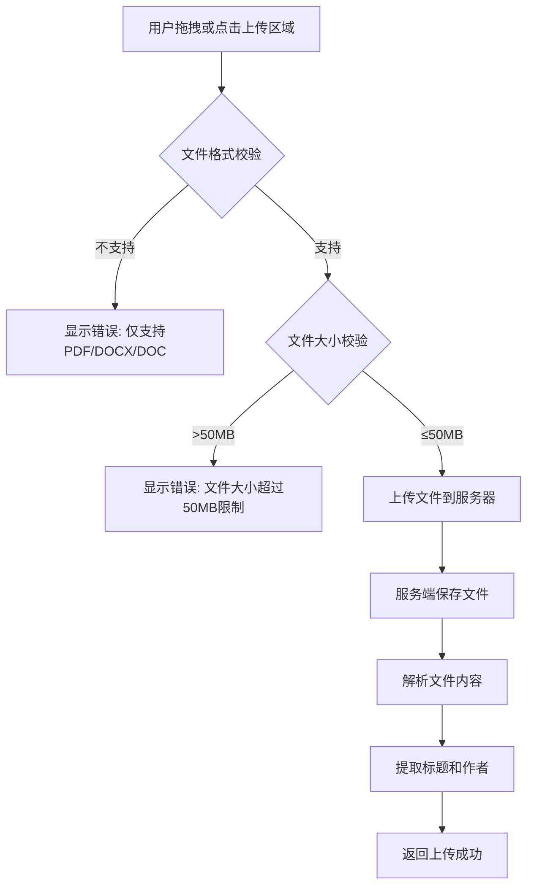
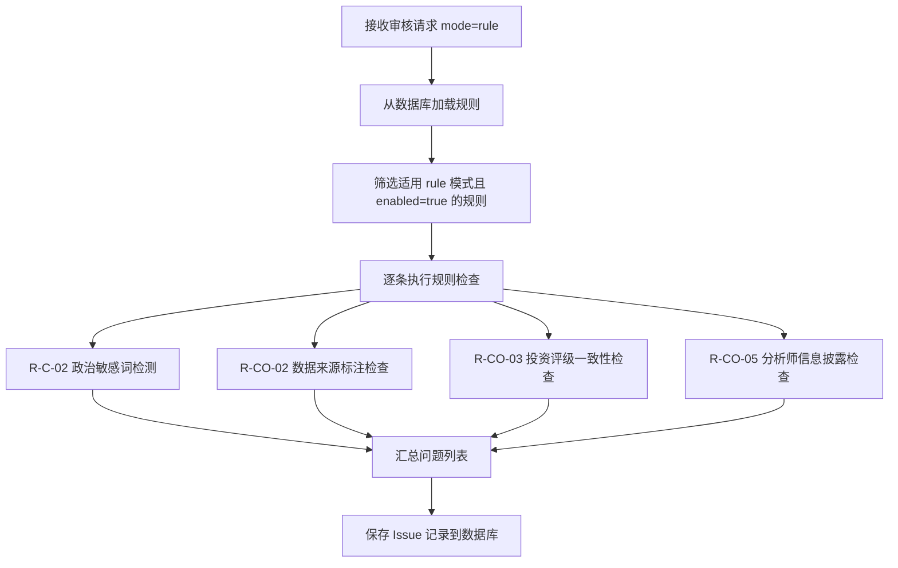
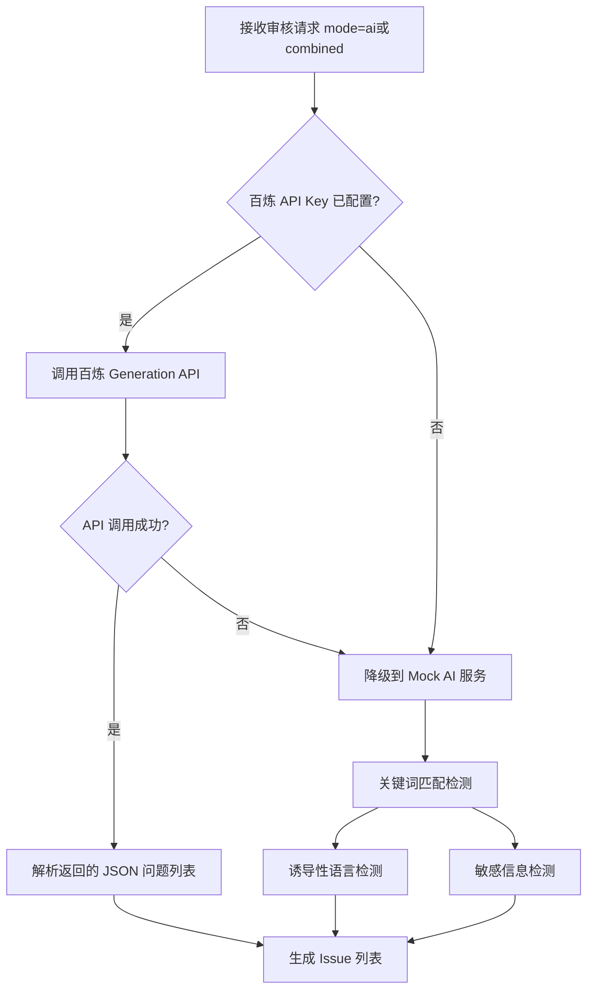
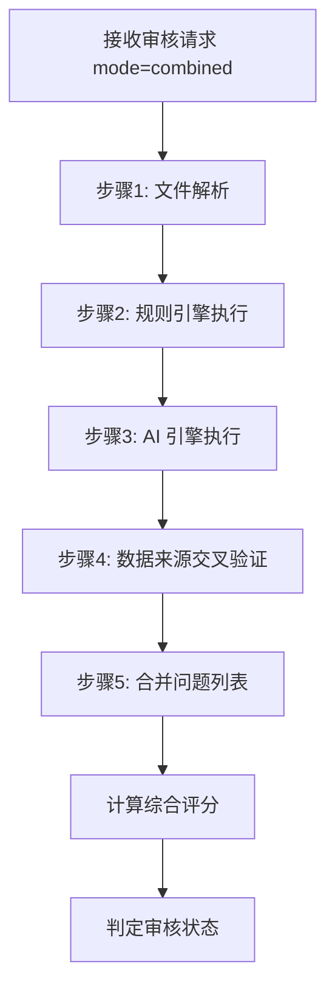
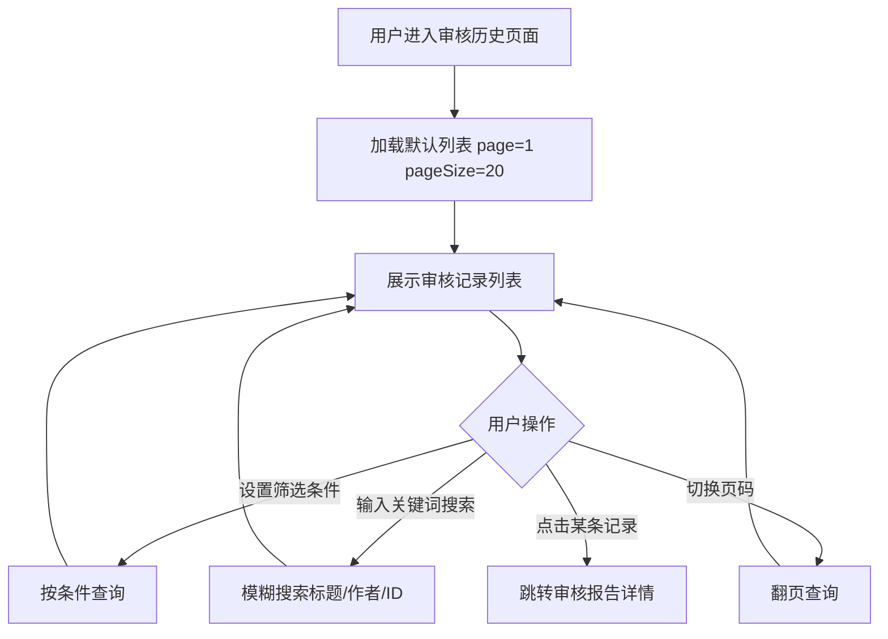
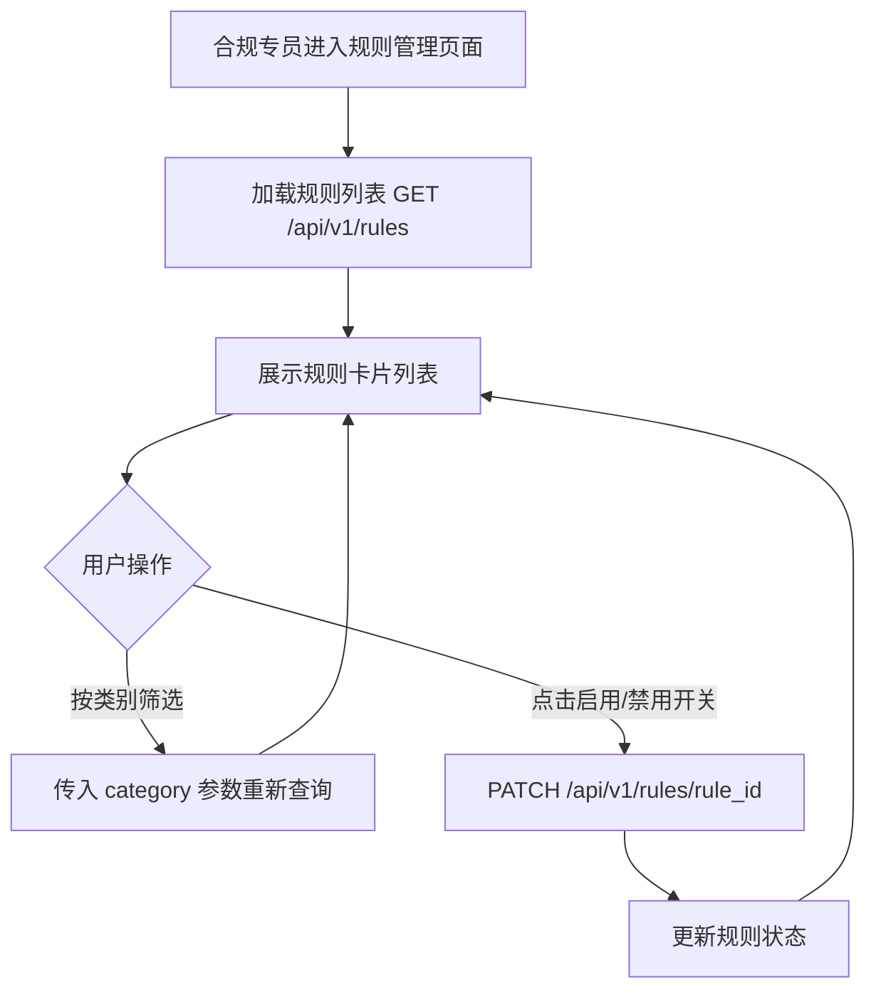
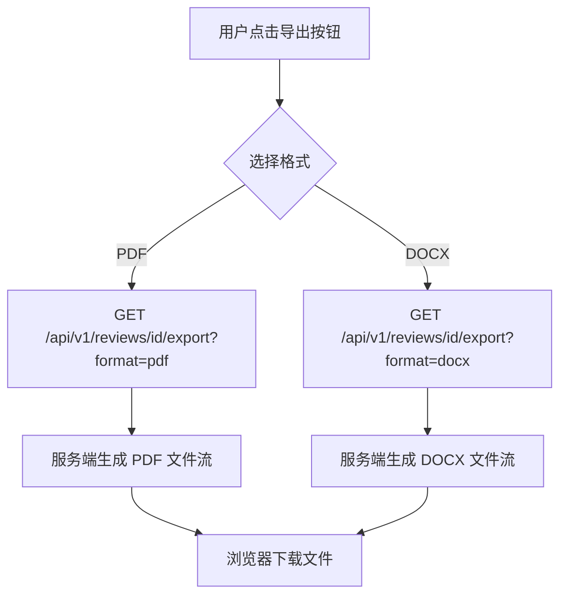

# 06 — 功能规格说明

> **06 只做一件事**：把 `05` 的 User Story 翻译成**前端可实现的界面行为规格**。"谁要什么"写在 05；"界面怎么表现"写在本文。

---

| 项       | 值                                     |
| -------- | -------------------------------------- |
| 模块编号 | M2-Review                              |
| 模块名称 | 研报审核助手                           |
| 文档版本 | v0.1                                   |
| 阶段     | Spec（What — UI / UX 行为）            |
| 上游     | `05` UserStory 与验收标准              |
| 下游     | → `08` 架构 · `09` API · `13` E2E 测试 |

---

## 1. 页面总体布局

> 研报审核助手为多页面 SPA（React + Vite），由 Header 导航栏 + 左侧 Sidebar + 右侧 Main Content 构成，包含审核提交、审核报告、审核历史、仪表盘、规则管理五大功能区域。

**布局结构**：

```
┌──────────────────────────────────────────────────────┐
│  Header: Logo + "研报合规稽核系统" + 导航菜单          │
├────────────┬─────────────────────────────────────────┤
│  Sidebar   │  Main Content（按路由切换）              │
│  导航菜单   │  A) 审核提交页 — 上传 + 配置 + 结果     │
│  · 提交审核 │  B) 审核历史页 — 列表 + 筛选 + 详情     │
│  · 审核历史 │  C) 仪表盘页 — 统计 + 趋势 + TOP5      │
│  · 仪表盘   │  D) 规则管理页 — 规则列表 + 开关        │
│  · 规则管理 │                                         │
└────────────┴─────────────────────────────────────────┘
```

## 2. Header 区域

### 2.1 视觉规格

| 元素   | 样式                                                    |
| ------ | ------------------------------------------------------- |
| 背景色 | 深蓝色主色调（Tailwind `bg-blue-900`）                  |
| 高度   | 60px                                                    |
| 左侧   | 系统图标 + "研报合规稽核系统" 标题（白色，18px）        |
| 右侧   | 导航菜单链接（提交审核 / 审核历史 / 仪表盘 / 规则管理） |

### 2.2 导航菜单

| 菜单项   | 路由             | 对齐功能    |
| -------- | ---------------- | ----------- |
| 提交审核 | `/` 或 `/review` | F-01 ~ F-04 |
| 审核历史 | `/history`       | F-06        |
| 仪表盘   | `/dashboard`     | F-07        |
| 规则管理 | `/rules`         | F-08        |

## 3. F-01 研报文件上传与解析

> 对齐 `05` US-001（提交研报审核）。用户通过拖拽或点击方式上传研报文件。

### 3.1 功能描述

支持用户上传 PDF/DOCX/DOC 格式研报文件，系统完成格式校验、文件保存后，自动解析提取研报标题和作者信息。

### 3.2 交互流程



### 3.3 输入/输出

**输入参数（multipart/form-data）**：

| 参数       | 类型   | 必填 | 说明     | 约束                                       |
| ---------- | ------ | ---- | -------- | ------------------------------------------ |
| file       | File   | 是   | 研报文件 | PDF/DOCX/DOC，≤50MB                        |
| reportType | string | 是   | 研报类型 | 枚举: 日报/周报/深度研究/首次覆盖/行业报告 |
| mode       | string | 是   | 审核模式 | 枚举: rule/ai/combined                     |

**输出（JSON）**：

| 字段    | 类型   | 说明                                    |
| ------- | ------ | --------------------------------------- |
| id      | string | 审核记录 ID，格式 `RV-{年份}-{4位序号}` |
| status  | string | 初始状态 `pending`                      |
| message | string | 提示信息                                |

### 3.4 业务规则

| 关联  | 规则内容                                                        |
| ----- | --------------------------------------------------------------- |
| BR-01 | 文件格式 MUST 为 PDF/DOCX/DOC，否则返回 `UNSUPPORTED_FILE_TYPE` |
| BR-02 | 文件大小 MUST ≤ 50MB，否则返回 `FILE_TOO_LARGE`                 |
| BR-09 | 审核 ID 格式为 `RV-{年份}-{4位序号}`                            |

### 3.5 文件解析细节

| 文件格式 | 解析方式                     | 标题提取                                   | 作者提取                                            |
| -------- | ---------------------------- | ------------------------------------------ | --------------------------------------------------- |
| PDF      | 优先 pdfplumber，回退 PyPDF2 | 第一页第一行文本（≤100字符）               | 前5行中含"分析师/研究员/作者"的行                   |
| DOCX/DOC | python-docx Document         | 第一个非空段落（≤100字符）或文档属性 title | 段落中含"分析师/研究员/作者"的文本或文档属性 author |

### 3.6 异常/边界场景

| 场景              | 处理方式                                         |
| ----------------- | ------------------------------------------------ |
| 未选择文件        | 前端禁用提交按钮；后端返回 400 "未提供文件"      |
| 文件内容为空      | 后端返回 400 "文件不能为空"                      |
| PDF 解析失败      | pdfplumber 失败后回退 PyPDF2；均失败返回解析错误 |
| 无法提取标题/作者 | 使用默认值 "未知标题" / "未知作者"               |

---

## 4. F-02 规则审核引擎

> 对齐 `05` US-008（AC-008-01）。基于预置规则对研报文本执行自动化合规检查。

### 4.1 功能描述

规则审核引擎从数据库加载适用当前审核模式的已启用规则，逐条对研报全文执行正则匹配和关键词检测，输出问题列表。

### 4.2 交互流程



### 4.3 规则检查明细

| 规则 ID | 检查项         | 检测逻辑                                                                                           | 严重程度 |
| ------- | -------------- | -------------------------------------------------------------------------------------------------- | -------- |
| R-C-02  | 政治敏感词检测 | 遍历敏感词列表（政治/政府/领导/中央/党），在文本中查找匹配位置，提取上下文（前20字后50字）         | P1       |
| R-CO-02 | 数据来源标注   | 按段落拆分文本，检测含数字数据（>50字符）的段落是否有来源关键词（来源：/根据/Wind/Bloomberg 等）   | P1       |
| R-CO-03 | 投资评级一致性 | 提取全文中出现的评级词汇（买入/增持/中性/减持/卖出/强烈推荐/推荐），若存在多个不同评级则报告不一致 | P2       |
| R-CO-05 | 分析师信息披露 | 检查全文是否包含"执业证书/执业编号/证书编号"（P1）及"利益冲突/无利益冲突"（P2）                    | P1/P2    |

### 4.4 业务规则

| 关联  | 规则内容                                 |
| ----- | ---------------------------------------- |
| BR-03 | 审核模式 MUST 为 rule/ai/combined 三选一 |

### 4.5 异常/边界场景

| 场景                 | 处理方式                       |
| -------------------- | ------------------------------ |
| 研报文本为空         | 跳过规则检查，不生成问题       |
| 所有适用规则均被禁用 | 正常完成审核，问题列表为空     |
| 规则执行异常         | 跳过当前规则，继续执行其他规则 |

---

## 5. F-03 AI 审核引擎

> 对齐 `05` US-008（AC-008-02）。基于大模型的智能内容审核（支持降级）。

### 5.1 功能描述

AI 审核引擎优先调用百炼大模型 API 对研报内容进行语义分析，检测诱导性语言、敏感信息等深层问题。若 API 不可用则自动降级为 Mock AI 服务（关键词匹配模式）。

### 5.2 交互流程



### 5.3 AI 检测维度

| 检测项       | 规则 ID | 严重程度 | 检测方式（Mock）                                                            |
| ------------ | ------- | -------- | --------------------------------------------------------------------------- |
| 诱导性语言   | R-CO-04 | P0       | 匹配关键词：确定上涨/必涨/稳赚/无风险/零风险/强烈推荐买入/立即买入/不容错过 |
| 敏感信息泄露 | R-C-01  | P0       | 匹配关键词：内幕消息/未公开/据内部人士                                      |

### 5.4 百炼 API 调用规格

| 项       | 值                                                                              |
| -------- | ------------------------------------------------------------------------------- |
| 模型     | 环境变量 `AI_MODEL`，默认 `qwen-plus`                                           |
| API Key  | 环境变量 `DASHSCOPE_API_KEY`                                                    |
| 内容截断 | 最大 8000 字符                                                                  |
| 返回格式 | JSON 数组，每项含 ruleId/ruleName/category/severity/location/excerpt/suggestion |

### 5.5 异常/边界场景

| 场景                  | 处理方式                             |
| --------------------- | ------------------------------------ |
| API Key 未配置        | 自动降级到 Mock AI 服务              |
| API 调用超时或异常    | 记录错误日志，降级到 Mock AI 服务    |
| API 返回非 JSON 格式  | 正则提取 JSON 数组，失败则返回空列表 |
| 文本超长（>8000字符） | 截断至 8000 字符后追加省略号         |

---

## 6. F-04 联合审核模式

> 对齐 `05` US-008（AC-008-03）。规则 + AI 双重检查，合并问题列表，综合评分。

### 6.1 功能描述

联合审核模式同时执行规则引擎和 AI 引擎，合并两者输出的问题列表，根据所有问题的严重程度综合计算评分。

### 6.2 交互流程



### 6.3 评分计算规则

| 问题严重程度        | 每个问题扣分 | 说明         |
| ------------------- | ------------ | ------------ |
| P0（严重-必须修复） | -20 分       | 合规硬性要求 |
| P1（重要-建议修复） | -10 分       | 内容质量要求 |
| P2（建议-可选优化） | -5 分        | 优化建议     |

- 基础分：100 分
- 最低分：0 分（`max(0, score)`）

### 6.4 状态判定规则

| 条件                | 审核状态             | 关联业务规则 |
| ------------------- | -------------------- | ------------ |
| 存在 P0 级问题      | `failed`             | BR-06        |
| 仅存在 P1/P2 级问题 | `warning`            | BR-07        |
| 无任何问题          | `passed`（评分 100） | BR-08        |

### 6.5 审核步骤与进度

| 步骤序号 | 步骤名称         | 进度百分比 |
| -------- | ---------------- | ---------- |
| 1        | 文件解析         | 15%        |
| 2        | 合规规则匹配     | 35%        |
| 3        | AI语义分析       | 58%        |
| 4        | 数据来源交叉验证 | 80%        |
| 5        | 生成审核报告     | 100%       |

---

## 7. F-05 审核报告生成与展示

> 对齐 `05` US-002（审核进度）、US-003（审核报告）。

### 7.1 功能描述

审核完成后生成包含评分、问题列表（含位置、严重程度、修改建议）的审核报告，前端通过轮询状态接口获取进度并在完成后展示完整报告。

### 7.2 审核进度展示（审核中）

| 展示元素     | 数据来源             | 说明                        |
| ------------ | -------------------- | --------------------------- |
| 进度条       | `progress`（0-100）  | 实时进度百分比              |
| 当前步骤     | `currentStep`        | 正在执行的步骤名称          |
| 步骤列表     | `steps[]`            | 每步含 name/status/progress |
| 预估剩余时间 | `estimatedRemaining` | 格式："{N}秒"               |

### 7.3 审核报告展示（已完成）

| 展示区域   | 数据字段                                | 说明                            |
| ---------- | --------------------------------------- | ------------------------------- |
| 基本信息   | id / title / author / reportType / mode | 审核记录概要                    |
| 评分与状态 | score / status                          | 综合评分（0-100）和审核结果状态 |
| 时间信息   | submittedAt / completedAt               | 提交和完成时间                  |
| 问题统计   | complianceIssues / contentIssues        | 合规问题数 / 内容问题数         |
| 问题列表   | issues[]                                | 每个问题详情                    |

### 7.4 问题详情卡片

| 字段       | 类型               | 展示方式                                  |
| ---------- | ------------------ | ----------------------------------------- |
| severity   | P0/P1/P2           | 颜色标签：P0 红色、P1 橙色、P2 蓝色       |
| ruleName   | string             | 规则名称标题                              |
| category   | compliance/content | 分类标签                                  |
| location   | string             | 问题位置描述（如"第3行附近"、"全文末尾"） |
| excerpt    | string             | 问题内容摘录                              |
| suggestion | string             | 修改建议文本                              |

### 7.5 异常/边界场景

| 场景               | 处理方式                                        |
| ------------------ | ----------------------------------------------- |
| 审核过程中出现异常 | 审核状态置为 `failed`，currentStep 记录错误信息 |
| 审核记录不存在     | 返回 404 `REVIEW_NOT_FOUND`                     |
| 问题列表为空       | 正常展示，评分 100，状态 `passed`               |

---

## 8. F-06 审核历史查询

> 对齐 `05` US-004（查询审核历史）。

### 8.1 功能描述

提供分页列表展示全部审核记录，支持按状态、模式、日期范围、关键词多条件筛选，默认按提交时间倒序排列。

### 8.2 交互流程



### 8.3 筛选参数

| 参数       | 类型     | 说明                                    | 对应 API 参数 |
| ---------- | -------- | --------------------------------------- | ------------- |
| 状态       | 下拉选择 | pending/reviewing/passed/failed/warning | `status`      |
| 审核模式   | 下拉选择 | rule/ai/combined                        | `mode`        |
| 开始日期   | 日期选择 | 筛选提交时间 ≥ startDate                | `startDate`   |
| 结束日期   | 日期选择 | 筛选提交时间 < endDate + 1天            | `endDate`     |
| 关键词搜索 | 文本输入 | 模糊匹配 title / author / id（ilike）   | `search`      |

### 8.4 列表项字段

| 字段             | 类型    | 说明                       |
| ---------------- | ------- | -------------------------- |
| id               | string  | 审核 ID（如 RV-2026-0042） |
| title            | string  | 研报标题                   |
| author           | string  | 作者                       |
| reportType       | string  | 研报类型                   |
| mode             | string  | 审核模式                   |
| status           | string  | 审核状态（颜色标签）       |
| score            | integer | 综合评分                   |
| fileName         | string  | 原始文件名                 |
| complianceIssues | integer | 合规问题数                 |
| contentIssues    | integer | 内容问题数                 |
| submittedAt      | string  | 提交时间                   |

### 8.5 业务规则

| 关联 | 规则内容                                                |
| ---- | ------------------------------------------------------- |
| —    | 默认分页 page=1，pageSize=20；按 submitted_at DESC 排序 |

---

## 9. F-07 仪表盘统计

> 对齐 `05` US-005（查看仪表盘统计）。

### 9.1 功能描述

为质检主管提供审核数据全貌，包含概览指标卡片、近 7 日趋势折线图、TOP5 常见问题横向柱状图。

### 9.2 概览指标卡片

| 指标       | 数据字段       | 计算逻辑                                 |
| ---------- | -------------- | ---------------------------------------- |
| 累计审核数 | `totalReviews` | `Review.query.count()`                   |
| 通过率     | `passRate`     | 近 30 天 passed 数 / 近 30 天总数 × 100% |
| 平均评分   | `avgScore`     | 近 30 天有评分记录的平均 score           |
| 今日审核数 | `todayCount`   | 今日 0 点后提交的审核数                  |
| 待审核数   | `pendingCount` | status='pending' 的记录数                |

### 9.3 近 7 日趋势图

| 数据维度 | 说明                           |
| -------- | ------------------------------ |
| X 轴     | 近 7 日日期（格式 M/D）        |
| Y 轴     | 审核数量                       |
| 折线 1   | 每日总审核数（total）          |
| 折线 2   | 每日通过数（passed）           |
| 折线 3   | 每日问题数（failed + warning） |

前端使用 Chart.js 渲染折线图。

### 9.4 TOP5 常见问题

| 字段  | 说明                  |
| ----- | --------------------- |
| name  | 规则名称（rule_name） |
| count | 出现次数              |
| pct   | 占比百分比            |

按 Issue 表 rule_name 分组统计，取 count 最高的 5 条，前端渲染为横向柱状图。

### 9.5 异常/边界场景

| 场景           | 处理方式                                           |
| -------------- | -------------------------------------------------- |
| 无审核数据     | 概览指标全部显示 0 / 0%，趋势图无数据点，TOP5 为空 |
| 近 30 天无审核 | 通过率和平均评分显示 0                             |

---

## 10. F-08 规则管理

> 对齐 `05` US-006（管理审核规则）。

### 10.1 功能描述

合规专员可查看系统内置的全部审核规则，按类别（compliance/content）筛选，通过开关控制规则的启用/禁用状态。

### 10.2 交互流程



### 10.3 规则卡片字段

| 字段        | 类型    | 说明                                      |
| ----------- | ------- | ----------------------------------------- |
| id          | string  | 规则 ID（如 R-C-02）                      |
| name        | string  | 规则名称                                  |
| category    | string  | 类别：compliance（合规）/ content（内容） |
| severity    | string  | 严重程度：P0 / P1 / P2                    |
| mode        | array   | 适用审核模式（如 ["rule", "combined"]）   |
| description | string  | 规则描述                                  |
| example     | string  | 示例违规内容                              |
| enabled     | boolean | 是否启用（开关状态）                      |

### 10.4 内置规则清单

| 规则 ID | 名称             | 类别       | 严重程度 | 适用模式           |
| ------- | ---------------- | ---------- | -------- | ------------------ |
| R-C-01  | 敏感信息泄露检测 | compliance | P0       | ai, combined       |
| R-C-02  | 政治敏感词检测   | compliance | P1       | rule, combined     |
| R-C-03  | 内幕信息检测     | compliance | P0       | ai, combined       |
| R-CO-01 | 风险提示完整性   | content    | P0       | ai, combined       |
| R-CO-02 | 数据来源标注     | content    | P1       | rule, ai, combined |
| R-CO-03 | 投资评级一致性   | content    | P2       | rule, ai, combined |
| R-CO-04 | 诱导性语言检测   | content    | P0       | ai, combined       |
| R-CO-05 | 分析师信息披露   | content    | P1       | rule, combined     |

### 10.5 异常/边界场景

| 场景                 | 处理方式                           |
| -------------------- | ---------------------------------- |
| enabled 参数非布尔值 | 返回 400 "enabled参数必须为布尔值" |
| 规则 ID 不存在       | 返回 404                           |

---

## 11. F-09 审核报告导出

> 对齐 `05` US-007（导出审核报告）。

### 11.1 功能描述

用户可将已完成的审核报告导出为 PDF 或 DOCX 文件，文件内容包含审核基本信息、问题统计和问题详情列表。

### 11.2 交互流程



### 11.3 导出内容结构

| 章节       | 内容                                                |
| ---------- | --------------------------------------------------- |
| 标题       | "审核报告 - {review_id}"                            |
| 基本信息表 | 研报标题/作者/类型/模式/状态/评分/提交时间/完成时间 |
| 问题统计   | 合规问题数 / 内容问题数 / 问题总数                  |
| 问题详情   | 序号 + [严重程度] 规则名称 + 位置 + 内容摘录 + 建议 |

### 11.4 输出格式

| 格式 | MIME Type                                                                 | 文件名                      | 实现依赖                          |
| ---- | ------------------------------------------------------------------------- | --------------------------- | --------------------------------- |
| PDF  | `application/pdf`                                                         | `审核报告_{review_id}.pdf`  | reportlab（不可用时回退纯文本）   |
| DOCX | `application/vnd.openxmlformats-officedocument.wordprocessingml.document` | `审核报告_{review_id}.docx` | python-docx（不可用时回退纯文本） |

### 11.5 异常/边界场景

| 场景               | 处理方式                       |
| ------------------ | ------------------------------ |
| reportlab 未安装   | 降级为纯文本格式（UTF-8 编码） |
| python-docx 未安装 | 降级为纯文本格式               |
| 审核记录未完成     | 仍可导出，评分字段显示 "-"     |

---

## 12. 错误处理总览

| 错误码                  | HTTP 状态 | 前端展示                                     | 触发场景                     |
| ----------------------- | --------- | -------------------------------------------- | ---------------------------- |
| `UNSUPPORTED_FILE_TYPE` | 400       | "不支持的文件格式，仅支持 .pdf, .docx, .doc" | 上传非法格式文件             |
| `FILE_TOO_LARGE`        | 400       | "文件大小超过50MB限制"                       | 文件超过 50MB                |
| `INVALID_REQUEST`       | 400       | "参数错误：{detail}"                         | 缺少必填参数或参数格式不合法 |
| `REVIEW_NOT_FOUND`      | 404       | "审核记录不存在"                             | 查询不存在的审核 ID          |
| `RULE_NOT_FOUND`        | 404       | "规则不存在"                                 | 操作不存在的规则 ID          |
| 服务端异常              | 500       | "服务器内部错误，请稍后重试"                 | 未捕获异常                   |

---

## 13. 状态管理

> 前端使用 React useState Hooks 管理组件状态。

| State 变量       | 类型           | 初始值     | 用途               |
| ---------------- | -------------- | ---------- | ------------------ |
| `currentView`    | `string`       | `'review'` | 当前页面视图       |
| `reviewFile`     | `File\|null`   | `null`     | 待上传文件         |
| `reportType`     | `string`       | `''`       | 选择的研报类型     |
| `reviewMode`     | `string`       | `'rule'`   | 选择的审核模式     |
| `isUploading`    | `boolean`      | `false`    | 上传/审核中状态    |
| `currentReview`  | `Review\|null` | `null`     | 当前查看的审核记录 |
| `reviewList`     | `Review[]`     | `[]`       | 审核历史列表       |
| `dashboardStats` | `object\|null` | `null`     | 仪表盘统计数据     |
| `trendData`      | `array`        | `[]`       | 趋势图数据         |
| `topIssues`      | `array`        | `[]`       | TOP5 问题数据      |
| `rules`          | `Rule[]`       | `[]`       | 规则列表           |
| `filters`        | `object`       | `{}`       | 当前筛选条件       |

---

## 14. US → FSD 对齐表

> 确保每条 US 的前端相关 AC 都在本文中有对应描述。

| UserStory | 验收标准涉及前端                | 本文章节                 |
| --------- | ------------------------------- | ------------------------ |
| US-001    | 文件上传 + 格式/大小校验 + 提交 | 3 F-01 文件上传          |
| US-002    | 审核进度轮询 + 步骤展示         | 7 F-05 审核报告 §7.2     |
| US-003    | 审核报告详情展示 + 问题卡片     | 7 F-05 审核报告 §7.3~7.4 |
| US-004    | 历史列表 + 筛选 + 分页          | 8 F-06 审核历史          |
| US-005    | 仪表盘统计 + 趋势图 + TOP5      | 9 F-07 仪表盘            |
| US-006    | 规则列表 + 启用/禁用开关        | 10 F-08 规则管理         |
| US-007    | 导出 PDF/DOCX 文件下载          | 11 F-09 报告导出         |
| US-008    | 审核模式选择 + 三种模式行为差异 | 4 F-02 + 5 F-03 + 6 F-04 |

---

| 版本 | 日期       | 说明     |
| ---- | ---------- | -------- |
| v0.1 | 2026-04-15 | 首版填写 |
