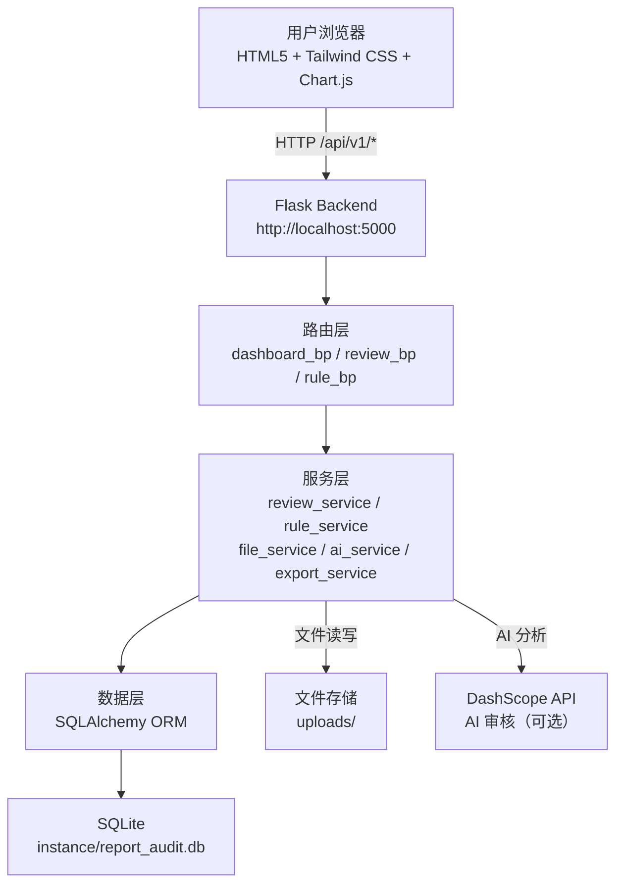

# 08 — 系统架构与技术选型

> **08 只做一件事**：描述模块的**系统架构决策和技术选型理由**。"用户要什么"在 05/06；"约束底线"在 07；"系统怎么组织、为什么这样组织"在本文。

---

| 项       | 值                                                  |
| -------- | --------------------------------------------------- |
| 模块编号 | M2-Review                                           |
| 模块名称 | 研报审核助手                                        |
| 文档版本 | v0.1                                                |
| 阶段     | Design（How — 架构决策）                            |
| 上游     | `05` 用户故事 · `06` 功能规格 · `07` 非功能需求     |
| 下游     | → `09` API 接口规格 · `10` 数据模型 · `12` 实施计划 |

---

## 1. 架构总览

### 1.1 系统上下文



### 1.2 架构风格

| 决策           | 选型                           | 理由                                                   |
| -------------- | ------------------------------ | ------------------------------------------------------ |
| **前后端分离** | HTML 静态页面 + Flask REST API | 前端无构建步骤，浏览器直接打开；后端提供标准 REST 接口 |
| **单体部署**   | Flask 单进程 + 后台线程        | 开发环境无需引入微服务复杂度                           |
| **分层架构**   | Route → Service → Model        | 职责清晰，替换存储引擎时上层零改动                     |
| **异步审核**   | Python `threading.Thread`      | 审核耗时较长，避免阻塞 HTTP 请求                       |

## 2. 后端分层结构

> 每层写清"允许做什么、禁止做什么"。

| 层          | 文件                         | 允许做                              | 禁止做                   |
| ----------- | ---------------------------- | ----------------------------------- | ------------------------ |
| **Route**   | `routes/review_bp.py`        | 参数校验、HTTP 状态码、调用 Service | 直接操作数据库、读写文件 |
|             | `routes/dashboard_bp.py`     | 调用 `review_service` 获取统计数据  | 直接执行 SQL 查询        |
|             | `routes/rule_bp.py`          | 调用 `rule_service` 管理规则        | 直接操作 Rule 模型       |
| **Service** | `services/review_service.py` | 审核流程编排、评分计算、状态管理    | 感知 HTTP 请求/响应      |
|             | `services/rule_service.py`   | 规则 CRUD、规则执行、内容检测       | 直接调用 AI 服务         |
|             | `services/file_service.py`   | 文件保存、PDF/Word 解析             | 操作数据库               |
|             | `services/ai_service.py`     | 调用 DashScope API 进行 AI 分析     | 操作本地存储             |
|             | `services/export_service.py` | 生成 PDF/DOCX 导出文件              | 修改数据库记录           |
| **Model**   | `models/review.py`           | 定义 Review 实体、`to_dict` 序列化  | 包含业务逻辑             |
|             | `models/issue.py`            | 定义 Issue 实体                     | 包含业务逻辑             |
|             | `models/rule.py`             | 定义 Rule 实体                      | 包含业务逻辑             |
| **Util**    | `utils/validators.py`        | 参数校验、枚举定义                  | 操作数据库               |
|             | `utils/errors.py`            | 错误码定义、异常类、全局错误处理    | 包含业务逻辑             |
|             | `utils/response.py`          | 统一响应格式、traceId 注入          | 包含业务逻辑             |

## 3. 前端架构

### 3.1 技术选型

| 项          | 选型                 | 理由                          |
| ----------- | -------------------- | ----------------------------- |
| 页面结构    | 原生 HTML5           | 无构建步骤，浏览器直接打开    |
| 样式框架    | Tailwind CSS (CDN)   | 实用优先的 CSS 框架，快速原型 |
| 图表库      | Chart.js (CDN)       | 仪表盘趋势图、统计图表        |
| 图标库      | Font Awesome (CDN)   | 丰富的图标资源                |
| HTTP 客户端 | 原生 `fetch` API     | 浏览器原生，不引入 axios      |
| 状态管理    | 原生 JavaScript 变量 | 页面级状态，无需状态管理框架  |

### 3.2 页面结构

| 页面   | 文件             | 功能                                   |
| ------ | ---------------- | -------------------------------------- |
| 主页面 | `index.html`     | 审核提交、历史列表、报告详情、规则管理 |
| 仪表盘 | `dashboard.html` | 概览统计、趋势图表、TOP5 问题          |

## 4. 审核流程编排

> 对齐 `07` §1.3 降级策略。审核流程通过后台线程异步执行。

```
ReviewService.start_review(review_id)
  └─ threading.Thread → _run_review(review_id)
       ├─[Step 1] 文件解析（file_service.parse_file）→ 提取标题/作者/文本
       ├─[Step 2] 合规规则匹配（rule_service.execute_rules）→ 规则检测
       ├─[Step 3] AI 语义分析（ai_service.analyze）→ 仅 ai/combined 模式
       ├─[Step 4] 数据来源交叉验证 → TODO
       └─[Step 5] 生成审核报告 → 计算评分、确定状态
```

| 步骤         | 进度 | 执行条件                                   | 错误处理               |
| ------------ | ---- | ------------------------------------------ | ---------------------- |
| 文件解析     | 15%  | 始终执行                                   | 解析失败记录错误，继续 |
| 合规规则匹配 | 35%  | 始终执行（rule/combined 模式执行规则子集） | 规则异常跳过           |
| AI 语义分析  | 58%  | 仅 `ai` / `combined` 模式                  | AI 不可用时跳过        |
| 数据来源验证 | 80%  | 始终执行                                   | TODO，当前跳过         |
| 生成审核报告 | 100% | 始终执行                                   | 异常时标记 `failed`    |

## 5. 数据存储架构

### 5.1 当前存储方案

| 项         | 说明                               |
| ---------- | ---------------------------------- |
| 引擎       | SQLite（通过 SQLAlchemy ORM 访问） |
| 数据库文件 | `instance/report_audit.db`         |
| 迁移工具   | Flask-Migrate（Alembic）           |
| 文件存储   | 本地 `uploads/` 目录               |

### 5.2 存储演进路线

| 阶段           | 存储                  | 变更范围            | 说明               |
| -------------- | --------------------- | ------------------- | ------------------ |
| **P0（当前）** | SQLite + 本地文件     | —                   | 开发环境，单机部署 |
| P1             | PostgreSQL + 本地文件 | ORM 连接字符串      | 支持多用户并发     |
| P2             | PostgreSQL + 对象存储 | file_service 适配层 | 生产级存储         |

## 6. 部署架构

| 服务          | 端口     | 启动命令                             |
| ------------- | -------- | ------------------------------------ |
| Flask Backend | **5000** | `flask run --port 5000`              |
| 前端静态文件  | —        | 浏览器直接打开 `frontend/index.html` |

| 生产部署 | 启动命令                                 |
| -------- | ---------------------------------------- |
| gunicorn | `gunicorn -w 4 -b 0.0.0.0:5000 wsgi:app` |

## 7. ADR（架构决策记录）

> 每条 ADR 记录一个"为什么选 A 而不选 B"的决策。

| ADR     | 决策                    | 核心理由                                                              |
| ------- | ----------------------- | --------------------------------------------------------------------- |
| ADR-001 | Flask 而非 FastAPI      | Flask 3.x 生态成熟，学习曲线低，无需 async/await                      |
| ADR-002 | SQLite 而非 PostgreSQL  | 零配置，开发环境无需安装数据库服务，`instance/` 目录下单文件即可      |
| ADR-003 | 前端不用 React/Vue 框架 | 快速原型阶段，原生 HTML + Tailwind CSS CDN 无构建步骤，浏览器直接打开 |
| ADR-004 | AI 审核用模拟实现       | MVP 阶段验证流程，DashScope API Key 可选配置，无 Key 时 AI 功能不可用 |
| ADR-005 | 后台线程而非 Celery     | 开发环境不引入 Redis/RabbitMQ 等消息队列，`threading.Thread` 足够     |
| ADR-006 | UUID 重命名上传文件     | 防止路径遍历攻击，避免文件名冲突                                      |

## 8. 第三方依赖

> 来源：`requirements.txt`

| 依赖             | 版本要求 | 用途                       | 许可证       |
| ---------------- | -------- | -------------------------- | ------------ |
| flask            | ≥ 3.0    | Web 框架                   | BSD-3-Clause |
| flask-cors       | ≥ 4.0    | 跨域资源共享               | MIT          |
| flask-sqlalchemy | ≥ 3.0    | SQLAlchemy ORM 集成        | BSD-3-Clause |
| flask-migrate    | ≥ 4.0    | 数据库迁移（Alembic 封装） | MIT          |
| python-dotenv    | ≥ 1.0    | `.env` 环境变量加载        | BSD-3-Clause |
| python-docx      | ≥ 1.0    | DOCX 文件解析              | MIT          |
| PyPDF2           | ≥ 3.0    | PDF 文件解析（备用）       | BSD-3-Clause |
| pdfplumber       | ≥ 0.10   | PDF 文件解析（首选）       | MIT          |
| reportlab        | ≥ 4.0    | PDF 导出生成               | BSD          |
| flasgger         | ≥ 0.9    | Swagger API 文档           | MIT          |
| pytest           | ≥ 8.0    | 单元测试框架               | MIT          |
| pytest-cov       | ≥ 4.0    | 测试覆盖率                 | MIT          |
| gunicorn         | ≥ 21.0   | 生产级 WSGI 服务器         | MIT          |

## 9. 安全架构

> 对齐 `07` §3 安全需求。详见 `11` 安全设计规格。

| 层       | 当前措施                            | 生产改进                |
| -------- | ----------------------------------- | ----------------------- |
| 认证     | 无（开放访问）                      | JWT Token               |
| CORS     | 全开放 `origins: "*"`               | 域名白名单              |
| 密钥     | 环境变量 `.env`                     | Vault / Secrets Manager |
| 文件校验 | 类型白名单 + 大小限制 + UUID 重命名 | 病毒扫描                |
| SQL 注入 | SQLAlchemy ORM 参数化查询           | 保持 ORM，禁止原生 SQL  |

---

| 版本 | 日期       | 说明     |
| ---- | ---------- | -------- |
| v0.1 | 2026-04-15 | 首版填写 |
