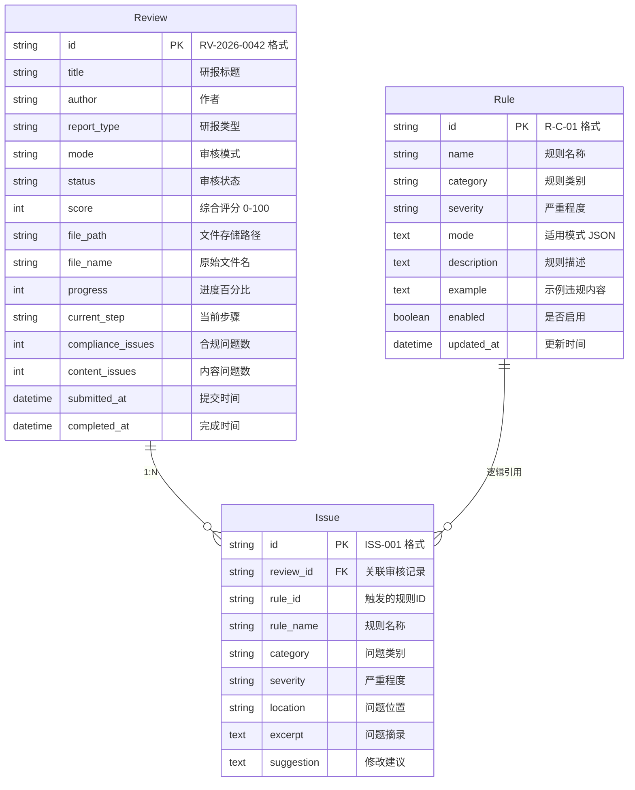

# 10 — 数据模型与存储规格

> **10 只做一件事**：定义模块的**数据实体、字段约束、存储引擎**以及数据访问方法清单。"怎么调接口"在 `09`；"数据怎么存"在本文。

---

| 项       | 值                                      |
| -------- | --------------------------------------- |
| 模块编号 | M2-Review                               |
| 模块名称 | 研报审核助手                            |
| 文档版本 | v0.1                                    |
| 阶段     | Design（How — 数据建模）                |
| 上游     | `08` 架构选型 · `09` API 规格           |
| 下游     | → `13` Storage 测试用例 · `14` 追踪矩阵 |

---

## 1. 概念模型



> **核心关系**：一个 Review 可包含零到多条 Issue。Issue 通过 `review_id` 外键关联 Review（级联删除）。Issue 通过 `rule_id` 逻辑引用 Rule（无外键约束）。Rule 为独立实体，不依赖 Review。

## 2. 存储引擎

| 项         | 说明                                                                 |
| ---------- | -------------------------------------------------------------------- |
| 引擎       | SQLite（Python 标准库 `sqlite3`）                                    |
| ORM        | SQLAlchemy ≥ 2.0（通过 flask-sqlalchemy ≥ 3.0）                      |
| 迁移       | Flask-Migrate ≥ 4.0（Alembic 封装）                                  |
| 数据库文件 | `instance/report_audit.db`                                           |
| 编码       | UTF-8                                                                |
| 并发安全   | SQLite WAL 模式，单写多读                                            |
| 连接字符串 | `sqlite:///report_audit.db`（`config.py` `SQLALCHEMY_DATABASE_URI`） |

## 3. 实体定义 — E-01 Review

> 来源：`models/review.py` `Review` 类

| 字段                | 列名                | 类型          | 必填 | 约束                                | 说明                                                        |
| ------------------- | ------------------- | ------------- | ---- | ----------------------------------- | ----------------------------------------------------------- |
| `id`                | `id`                | `String(20)`  | 是   | **PK**                              | 审核记录 ID，格式 `RV-{年份}-{4位序号}`                     |
| `title`             | `title`             | `String(500)` | 否   | nullable                            | 研报标题，文件解析后自动填充                                |
| `author`            | `author`            | `String(100)` | 否   | nullable                            | 作者，文件解析后自动填充                                    |
| `report_type`       | `report_type`       | `String(50)`  | 是   | NOT NULL                            | 研报类型：日报/周报/深度研究/首次覆盖/行业报告              |
| `mode`              | `mode`              | `String(20)`  | 是   | NOT NULL                            | 审核模式：`rule`/`ai`/`combined`                            |
| `status`            | `status`            | `String(20)`  | 是   | NOT NULL, default `'pending'`       | 审核状态：`pending`/`reviewing`/`passed`/`failed`/`warning` |
| `score`             | `score`             | `Integer`     | 否   | nullable, 0-100                     | 综合评分，审核完成后计算                                    |
| `file_path`         | `file_path`         | `String(500)` | 否   | nullable                            | 文件存储路径（相对路径）                                    |
| `file_name`         | `file_name`         | `String(255)` | 否   | nullable                            | 原始文件名                                                  |
| `progress`          | `progress`          | `Integer`     | 是   | default `0`, 0-100                  | 审核进度百分比                                              |
| `current_step`      | `current_step`      | `String(100)` | 否   | nullable                            | 当前审核步骤描述                                            |
| `compliance_issues` | `compliance_issues` | `Integer`     | 是   | default `0`                         | 合规问题数                                                  |
| `content_issues`    | `content_issues`    | `Integer`     | 是   | default `0`                         | 内容问题数                                                  |
| `submitted_at`      | `submitted_at`      | `DateTime`    | 是   | default `utcnow`                    | 提交时间                                                    |
| `completed_at`      | `completed_at`      | `DateTime`    | 否   | nullable                            | 完成时间                                                    |
| `created_at`        | `created_at`        | `DateTime`    | 是   | default `utcnow`                    | 创建时间                                                    |
| `updated_at`        | `updated_at`        | `DateTime`    | 是   | default `utcnow`, onupdate `utcnow` | 更新时间                                                    |

**ID 生成规则**：`Review.generate_id()` 查询当年最大序号 + 1，格式 `RV-{year}-{seq:04d}`。

**关联关系**：`issues = db.relationship('Issue', backref='review', lazy='dynamic', cascade='all, delete-orphan')`

## 4. 实体定义 — E-02 Issue

> 来源：`models/issue.py` `Issue` 类

| 字段         | 列名         | 类型          | 必填 | 约束                            | 说明                             |
| ------------ | ------------ | ------------- | ---- | ------------------------------- | -------------------------------- |
| `id`         | `id`         | `String(20)`  | 是   | **PK**                          | 问题 ID，格式 `ISS-{3位序号}`    |
| `review_id`  | `review_id`  | `String(20)`  | 是   | **FK** → `reviews.id`, NOT NULL | 关联审核记录                     |
| `rule_id`    | `rule_id`    | `String(20)`  | 是   | NOT NULL                        | 触发的规则 ID                    |
| `rule_name`  | `rule_name`  | `String(100)` | 是   | NOT NULL                        | 规则名称                         |
| `category`   | `category`   | `String(20)`  | 是   | NOT NULL                        | 问题类别：`compliance`/`content` |
| `severity`   | `severity`   | `String(5)`   | 是   | NOT NULL                        | 严重程度：`P0`/`P1`/`P2`         |
| `location`   | `location`   | `String(200)` | 否   | nullable                        | 问题位置描述（如"第3页第2段"）   |
| `excerpt`    | `excerpt`    | `Text`        | 否   | nullable                        | 问题内容摘录                     |
| `suggestion` | `suggestion` | `Text`        | 否   | nullable                        | 修改建议                         |
| `created_at` | `created_at` | `DateTime`    | 是   | default `utcnow`                | 创建时间                         |

**ID 生成规则**：`Issue.generate_id()` 查询全局最大序号 + 1，格式 `ISS-{seq:03d}`。

## 5. 实体定义 — E-03 Rule

> 来源：`models/rule.py` `Rule` 类

| 字段          | 列名          | 类型          | 必填 | 约束                                | 说明                                                        |
| ------------- | ------------- | ------------- | ---- | ----------------------------------- | ----------------------------------------------------------- |
| `id`          | `id`          | `String(20)`  | 是   | **PK**                              | 规则 ID，格式 `R-{类别缩写}-{序号}`                         |
| `name`        | `name`        | `String(100)` | 是   | NOT NULL                            | 规则名称                                                    |
| `category`    | `category`    | `String(20)`  | 是   | NOT NULL                            | 规则类别：`compliance`/`content`                            |
| `severity`    | `severity`    | `String(5)`   | 是   | NOT NULL                            | 严重程度：`P0`/`P1`/`P2`                                    |
| `mode`        | `mode`        | `Text`        | 是   | NOT NULL                            | 适用审核模式，JSON 数组字符串（如 `'["rule","combined"]'`） |
| `description` | `description` | `Text`        | 否   | nullable                            | 规则描述                                                    |
| `example`     | `example`     | `Text`        | 否   | nullable                            | 示例违规内容                                                |
| `enabled`     | `enabled`     | `Boolean`     | 是   | default `True`                      | 是否启用                                                    |
| `created_at`  | `created_at`  | `DateTime`    | 是   | default `utcnow`                    | 创建时间                                                    |
| `updated_at`  | `updated_at`  | `DateTime`    | 是   | default `utcnow`, onupdate `utcnow` | 更新时间                                                    |

**内置规则**（`rule_service.py` `BUILTIN_RULES`，共 8 条）：

| 规则 ID | 名称             | 类别       | 严重程度 | 适用模式           |
| ------- | ---------------- | ---------- | -------- | ------------------ |
| R-C-01  | 敏感信息泄露检测 | compliance | P0       | ai, combined       |
| R-C-02  | 政治敏感词检测   | compliance | P1       | rule, combined     |
| R-C-03  | 内幕信息检测     | compliance | P0       | ai, combined       |
| R-CO-01 | 风险提示完整性   | content    | P0       | ai, combined       |
| R-CO-02 | 数据来源标注     | content    | P1       | rule, ai, combined |
| R-CO-03 | 投资评级一致性   | content    | P2       | rule, ai, combined |
| R-CO-04 | 诱导性语言检测   | content    | P0       | ai, combined       |
| R-CO-05 | 分析师信息披露   | content    | P1       | rule, combined     |

## 6. 索引策略

| 表        | 索引列         | 类型             | 说明                                                           |
| --------- | -------------- | ---------------- | -------------------------------------------------------------- |
| `reviews` | `id`           | PRIMARY KEY      | 主键索引，SQLite 自动创建                                      |
| `reviews` | `submitted_at` | 隐式（查询优化） | 按提交时间排序分页查询，`order_by(Review.submitted_at.desc())` |
| `reviews` | `status`       | 隐式（查询优化） | 按状态筛选，`filter(Review.status == status)`                  |
| `issues`  | `id`           | PRIMARY KEY      | 主键索引                                                       |
| `issues`  | `review_id`    | FOREIGN KEY      | 外键索引，SQLite 自动创建；按审核记录查询问题列表              |
| `rules`   | `id`           | PRIMARY KEY      | 主键索引                                                       |
| `rules`   | `enabled`      | 隐式（查询优化） | 按启用状态过滤规则                                             |

> **注**：SQLite 在开发阶段数据量小（< 10,000 条），隐式索引通过顺序扫描即可满足性能要求。生产环境迁移至 PostgreSQL 后需显式创建索引。

## 7. 存储与备份

### 7.1 存储预估

| 数据类型      | 单条大小 | 预估年增量 | 年存储量 |
| ------------- | -------- | ---------- | -------- |
| Review 记录   | ~1 KB    | 5,000 条   | ~5 MB    |
| Issue 记录    | ~0.5 KB  | 15,000 条  | ~7.5 MB  |
| Rule 记录     | ~0.3 KB  | 固定 8 条  | 忽略     |
| 上传文件      | ~2 MB/份 | 5,000 份   | ~10 GB   |
| SQLite 数据库 | —        | —          | ~50 MB   |

### 7.2 备份策略

| 项         | 当前策略                            | 生产改进            |
| ---------- | ----------------------------------- | ------------------- |
| 数据库备份 | 手动复制 `instance/report_audit.db` | 定时备份 + 异地存储 |
| 文件备份   | 无                                  | 对象存储 + 多副本   |
| 备份频率   | 按需                                | 每日增量 + 每周全量 |
| 恢复方式   | 替换 `.db` 文件 + 重启 Flask        | 自动化恢复脚本      |

## 8. 关键业务逻辑

### 8.1 评分计算

```python
def _calculate_score(self, issues):
    score = 100
    for issue in issues:
        if issue.severity == 'P0':
            score -= 20
        elif issue.severity == 'P1':
            score -= 10
        elif issue.severity == 'P2':
            score -= 5
    return max(0, score)
```

### 8.2 状态判定

| 逻辑       | 触发条件                 | 行为                                                     |
| ---------- | ------------------------ | -------------------------------------------------------- |
| 审核通过   | 无任何问题               | `status = 'passed'`, `score = 100`                       |
| 审核警告   | 仅存在 P1/P2 问题，无 P0 | `status = 'warning'`                                     |
| 审核未通过 | 存在 P0 问题             | `status = 'failed'`                                      |
| 级联删除   | 删除 Review              | 自动删除所有关联 Issue（`cascade='all, delete-orphan'`） |

## 9. API 响应 DTO 概要

> 详细端点定义见 `09`。此处列出关键 DTO 与存储字段的映射关系。

| API 端点                          | 核心 DTO 字段                          | 字段映射说明                                |
| --------------------------------- | -------------------------------------- | ------------------------------------------- |
| `POST /api/v1/reviews`            | id, status, message                    | `Review.generate_id()` 生成 ID              |
| `GET /api/v1/reviews`             | list[].id/title/author/score/status... | `Review.to_list_dict()` 序列化              |
| `GET /api/v1/reviews/<id>`        | 完整 Review + issues[]                 | `Review.to_dict()` + `Issue.to_dict()`      |
| `GET /api/v1/reviews/<id>/status` | id, status, progress, steps            | `ReviewService.get_review_status()`         |
| `GET /api/v1/rules`               | rules[].id/name/category/mode...       | `Rule.to_dict()`，`mode` 字段 JSON 反序列化 |
| `PATCH /api/v1/rules/<id>`        | id, name, enabled, updatedAt           | `RuleService.update_rule()`                 |

---

| 版本 | 日期       | 说明     |
| ---- | ---------- | -------- |
| v0.1 | 2026-04-15 | 首版填写 |
